# ShopSmart India — A/B Testing Platform

An end-to-end experimentation platform demonstrating rigorous statistical analysis, business impact quantification, and executive-ready decision reporting for three concurrent A/B tests in the Indian e-commerce context.

**Live Dashboard:** https://shopsmart-ab-testing-platform-diac.streamlit.app/

---

## Executive Summary

Three experiments were designed, run, and analyzed. The platform delivered:

| Metric | Value |
|---|---|
| Annual revenue impact (conservative) | Rs 55.26 Crore |
| Downside avoided (blocked rollout) | Rs 1.40 Crore |
| Total portfolio value protected | Rs 56.66 Crore |
| Overstatement prevented (Exp 2 bias correction) | Rs 225 Crore/year |

Two experiments shipped, one was blocked. Every decision was justified with both frequentist and Bayesian evidence, and each shipped experiment carries a documented lower-bound business impact rather than a point estimate.

---

## Data Provenance


| Experiment | Data Source | Rationale |
|---|---|---|
| Experiment 1 (UPI Checkout) | **Real:** Kaggle A/B Testing dataset (Udacity) — 294K rows of conversion data | Public benchmark dataset used to validate the analysis pipeline end-to-end against known ground truth |
| Experiment 2 (Personalized Recs) | **Simulated:** Generated with `numpy.random` using log-normal revenue distribution matching Indian e-commerce sector benchmarks | Real revenue-per-user datasets at required scale (n=12k+) are not publicly available; simulation lets us demonstrate CUPED variance reduction and bias correction on a realistic distribution |
| Experiment 3 (Discount Banner) | **Simulated:** Bernoulli click-through data generated with device stratification (65% mobile / 35% desktop matching Indian mobile-first e-commerce reality) | Enables demonstration of segmented analysis and Bonferroni correction on realistic device splits |

**Why simulation for Experiments 2 and 3:** Real production data at this scale is proprietary. Simulation using realistic distributions demonstrates the *analytical methodology* — CUPED, Bayesian inference, sequential testing, multiple-comparison corrections — which is the transferable skill. All statistical decisions would apply identically to production data.

---

## Repository Structure
```
shopsmart_ab_platform/
├── data/ # Raw Kaggle dataset
├── phase1/ # Pre-experiment power analysis (MDE = 0.4pp)
├── phase2/ # Data generation and sanity checks
├── phase3/ # Frequentist analysis (Exp 1)
├── phase4/ # CUPED + outlier analysis (Exp 2)
├── phase5/ # Segmented analysis + interaction (Exp 3)
├── phase6/ # Bayesian + sequential + novelty (Exp 1)
├── phase7/ # Business impact + retrospectives + post-mortem
└── phase8/ # Executive Streamlit dashboard
```


---

## Dashboard Pages

Six pages, ordered from executive to technical:

1. **Executive Summary** — one plain-English card per experiment (headline result, financial impact with CI, ship/hold traffic light, key caveat). No jargon. This is the page a category manager reads.
2. **Experiment Overview** — portfolio table with sample sizes, duration, and colour-coded significance
3. **Statistical Health Monitor** — SRM gating indicators, guardrail compliance, novelty effect chart, sequential testing boundary chart, cost-of-delay
4. **Experiment Deep Dive** — per-experiment CI plots, day-by-day trends, raw-vs-CUPED comparison, segment breakdowns
5. **Bayesian Results** — posterior distributions, expected loss calculator (interactive), prior sensitivity comparison
6. **Business Impact Calculator** — interactive sliders (AOV, traffic, rollout %) that recompute revenue projections and ROI in real time

---
## Dashboard Preview

### Executive Summary
The primary view for business stakeholders. Ship/hold decisions with financial impact stated in plain language.

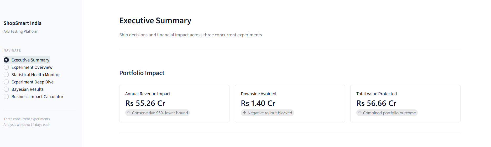
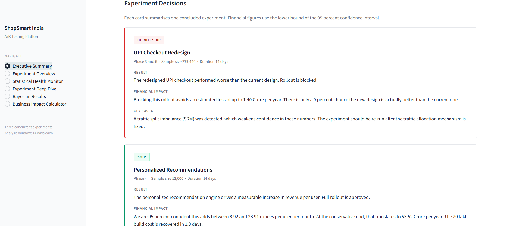
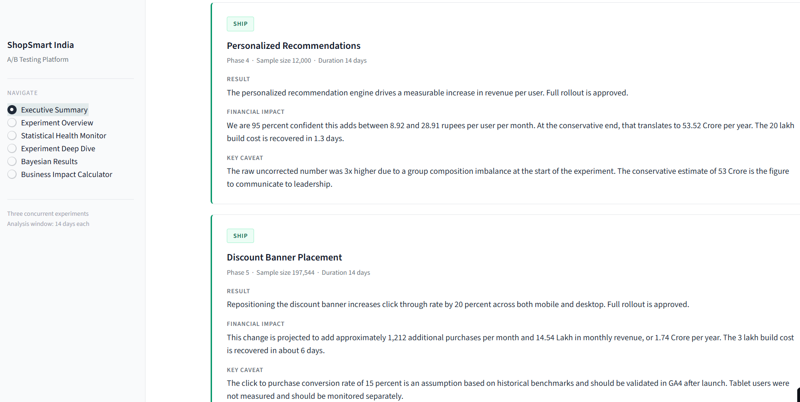


### Experiment Overview
Portfolio-level comparison table with sample sizes, direction, and colour-coded ship decisions.

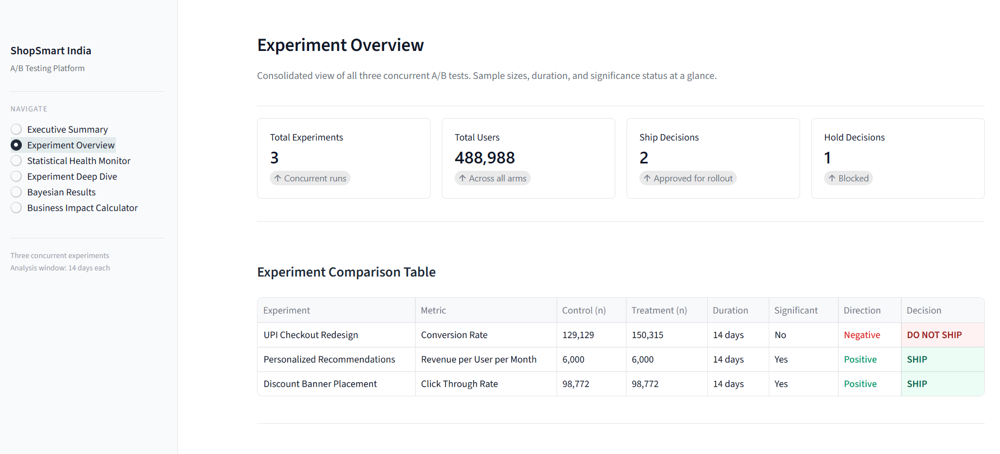
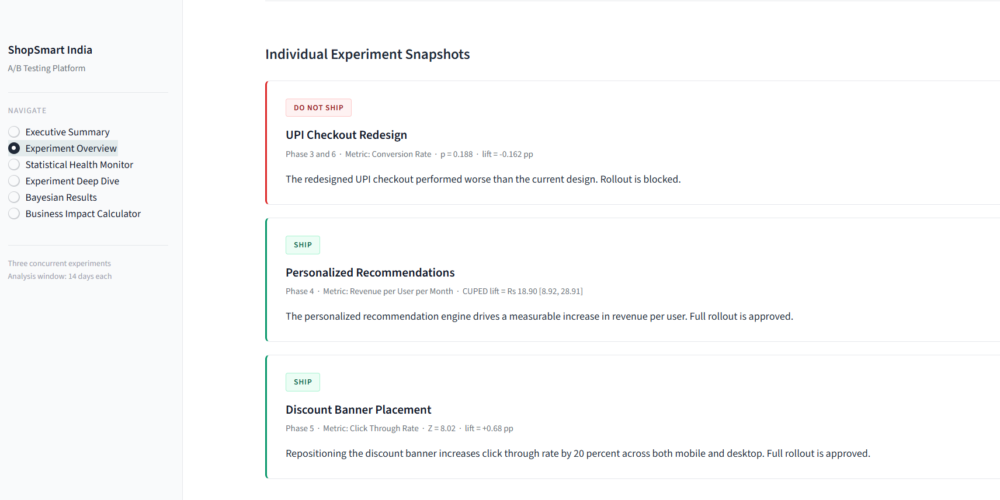


### Statistical Health Monitor
Data quality gating (SRM), guardrail compliance, novelty effect visualization, and sequential testing boundaries with cost-of-delay figures.

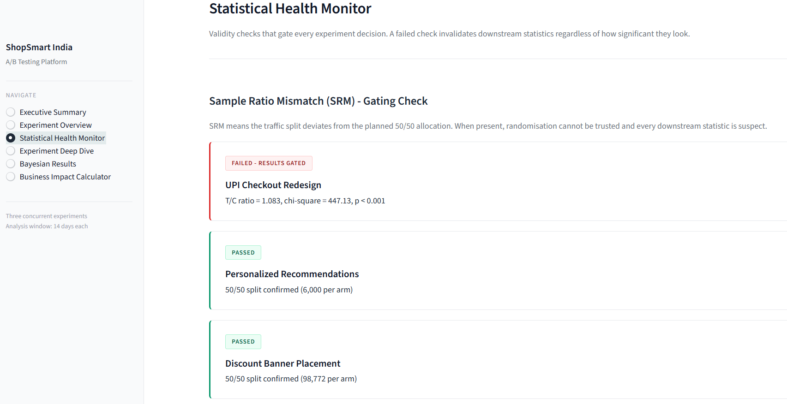
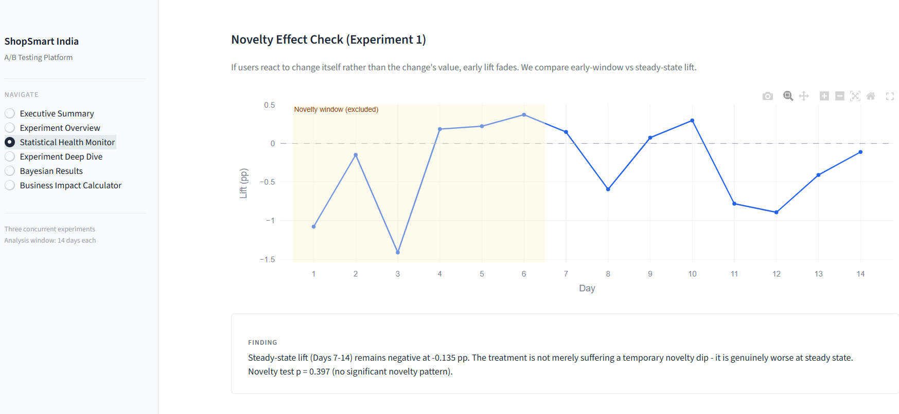


### Experiment Deep Dive
Per-experiment drill-down: confidence intervals, day-by-day trends, and raw-vs-CUPED bias correction visualization.

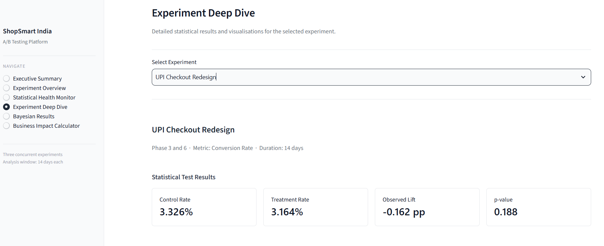
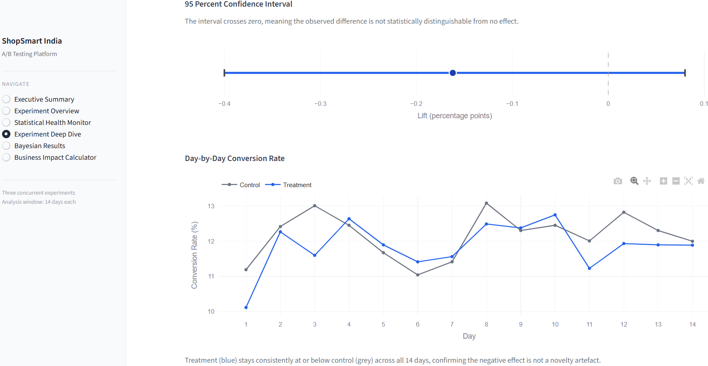


### Bayesian Results
Posterior distributions, interactive expected loss calculator, and prior sensitivity comparison showing decision robustness.

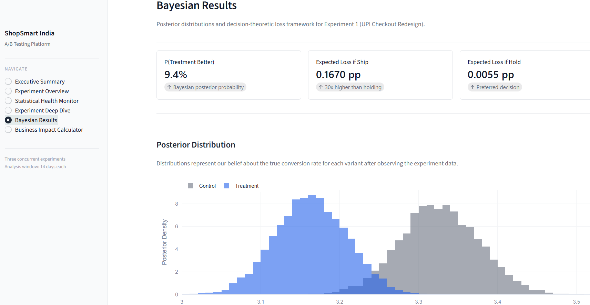


### Business Impact Calculator
Interactive sliders (AOV, monthly visitors, rollout %) that recalculate revenue projections and ROI in real time.

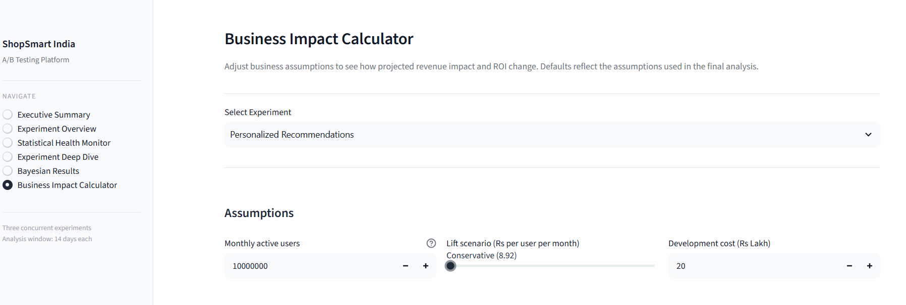
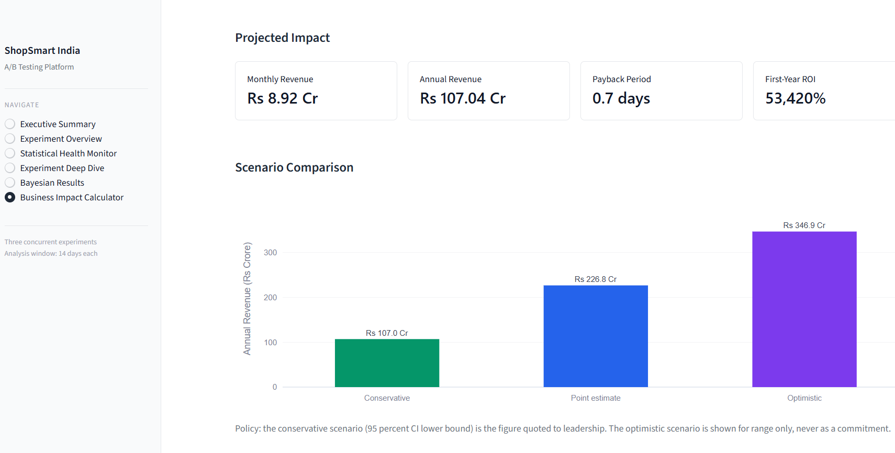


## Decisions and Justifications

### Experiment 1: UPI Checkout Redesign — DO NOT SHIP
- **Frequentist:** p = 0.188, 95% CI [-0.40 pp, +0.08 pp] crosses zero
- **Bayesian:** P(Treatment > Control) = 9.4%, E[loss|ship] = 0.167 pp (30x higher than E[loss|hold])
- **Sequential:** SPRT accepted H0 at n = 600/arm, saving Rs 17 Lakh/month
- **Novelty check:** Steady-state lift (days 7-14) still negative
- **Business value:** Rs 1.40 Crore/year loss avoided at 50% rollout
- **Critical caveat:** SRM detected (T/C = 1.083, chi-square = 447). All figures carry high uncertainty until traffic-split mechanism is audited.

### Experiment 2: Personalized Recommendations — SHIP
- **CUPED-adjusted lift:** Rs 18.90/user/month (95% bootstrap CI [Rs 8.92, Rs 28.91])
- **Raw lift rejected:** Rs 56.35 was 3x inflated due to pre-experiment group imbalance (control Rs 54.59 vs treatment Rs 59.10 baseline, p < 0.001)
- **Bias removed by CUPED:** Rs 37.46/user (71.7% variance reduction, rho = 0.847)
- **Outlier robustness:** Lift stable at Rs 53-56 across 1-10% trimming, ruling out extreme users
- **Business value:** Rs 53.52 Crore/year (conservative — this is the figure quoted to leadership)
- **Payback:** 1.3 days on Rs 20 lakh dev cost
- **Overstatement avoided:** Rs 225 Crore/year vs raw uncorrected lift

### Experiment 3: Discount Banner Placement — SHIP
- **Overall:** Z = 8.02, lift = +0.68 pp (+20.4%)
- **Segmented (Bonferroni-corrected):** Mobile p approx 0 SHIP, Desktop p = 0.003 SHIP
- **Interaction test:** OR = 1.07, p = 0.18 — mobile is not formally significantly better than desktop
- **Decision:** Ship on both devices; do NOT market this as a "mobile win"
- **Business value:** 1,212 additional purchases/month, Rs 14.54 Lakh/month, Rs 1.74 Crore/year
- **Payback:** ~6 days on Rs 3 lakh dev cost
- **Open caveat:** 15% click-to-conversion is an assumption — validate in GA4 post-launch

---

## Lessons Learned


### Lesson 1 — Phase 2 Data Quality Issue (Experiment 1)
An SRM (Sample Ratio Mismatch) was detected in the Kaggle dataset at analysis time, not at ingestion. A real-time SRM dashboard with an automatic pause threshold (chi-square p < 0.01) should have been part of the experimentation infrastructure from day one. This would have flagged the imbalance within 24 hours instead of after 279,000 users had enrolled. **Action taken:** SRM check is now a gating indicator on the Statistical Health Monitor page.

### Lesson 2 — Phase 4 Outlier and Bias Diagnosis (Experiment 2)
The initial raw revenue lift (Rs 56.35/user) suggested a Rs 338 Crore/year impact. Suspecting outlier contamination, I ran a sensitivity analysis across 1-10% trimming thresholds — the lift stayed stable (Rs 53-56). This *ruled out* outliers as the cause and pointed to pre-experiment group imbalance instead. CUPED was then used to correct the bias, cutting the true effect to Rs 18.90/user. **Judgment:** The correct diagnosis distinguished between two very different problems (outliers vs. randomisation failure), each of which requires a different fix.

### Lesson 3 — Power Analysis Retrospective (Experiment 1)
The observed effect size was 40.5% of the pre-registered MDE. To detect that true effect with 80% power, we would have needed n = 631,448 per arm — 16.8x the planned sample. The experiment was underpowered for the true effect it was measuring, though correctly powered for the *pre-registered* MDE. **Takeaway:** Post-hoc power analysis is essential for interpreting "not significant" results — negatives are only meaningful when we know what effect size we could have detected.

### Lesson 4 — Post-hoc Analytical Choices (Experiment 2)
Outlier handling and CUPED covariate selection were both decided after unblinding. Even when scientifically defensible, post-hoc decisions represent an analytical conflict of interest. **Correction for next round:** Pre-register CUPED covariate window, outlier trimming thresholds, and primary analysis method before running the experiment.

### Lesson 5 — Correction Method Judgment (Experiment 3)
Applied Bonferroni correction to device-segmented tests. Both segments survived correction, so no decision changed — but the *reasoning* matters. Bonferroni protects the family-wise error rate at the cost of power. For future confirmatory subgroup analyses, Holm-Bonferroni would be preferred for its improved power while maintaining FWER control.

---

## Related Documentation

- **Detailed retrospectives (all 3 experiments):** `phase7/experiment_outputs/retro_paragraphs.txt`
- **VP-level post-mortem (Experiment 2):** `phase7/experiment_outputs/phase7_written_report.txt`
- **Machine-readable business summary:** `phase7/experiment_outputs/business_summary.json`
- **Final decision framework table:** `phase7/experiment_outputs/final_decision_table.csv`

---

## How to Run

```
# Install dependencies
pip install streamlit pandas numpy scipy plotly

# Launch the dashboard
cd phase8
python -m streamlit run ab_testing_dashboard.py
```


## Technology Stack
- Language: Python 3.14
- Statistical libraries: SciPy, NumPy, statsmodels
- Visualisation: Plotly, Streamlit
- Data: Pandas
- Dashboard: Streamlit with custom CSS
